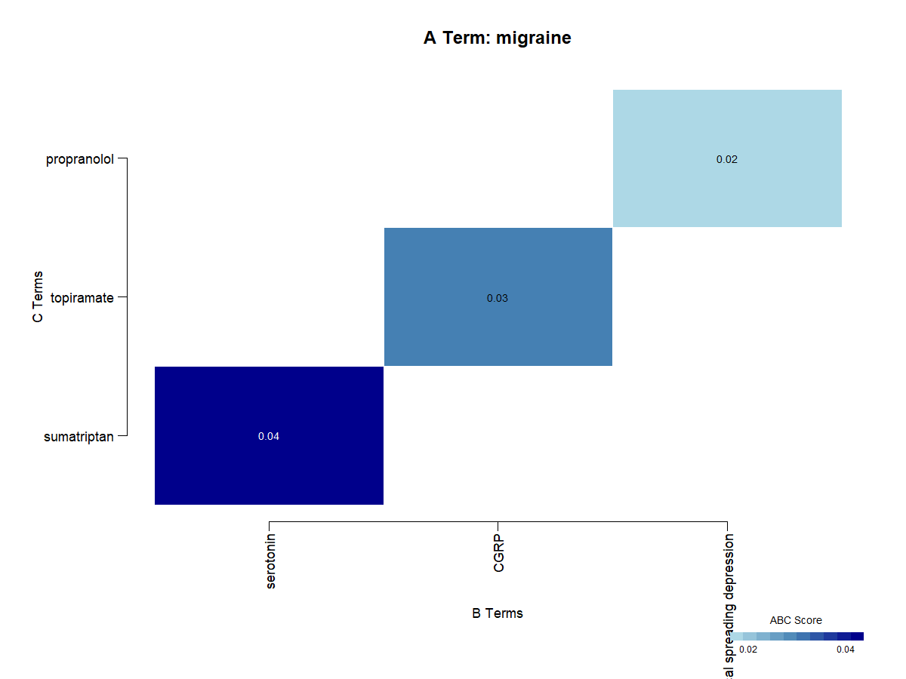

# Migraine Discovery Workflow

This article mirrors the package example script at:

- `inst/examples/migraine_example.R`

``` r
library(LBDiscover)
library(LBDiscoverAnalysis)
```

### 1. Retrieve and combine literature

``` r
primary_term <- "migraine"

migraine_articles <- pubmed_search(
  query = paste0(primary_term, " pathophysiology"),
  max_results = 1000
)

drug_articles <- pubmed_search(
  query = "neurological drugs pain treatment OR migraine therapy OR headache medication",
  max_results = 1000
)

all_articles <- merge_results(migraine_articles, drug_articles)
```

### 2. Preprocess and extract entities

``` r
primary_term_variations <- get_term_vars(all_articles, primary_term)

preprocessed_articles <- preprocess_text(
  all_articles,
  text_column = "abstract",
  remove_stopwords = TRUE,
  min_word_length = 2
)

custom_dictionary <- data.frame(
  term = c(primary_term, primary_term_variations),
  type = rep("disease", length(primary_term_variations) + 1),
  id = paste0("CUSTOM_", 1:(length(primary_term_variations) + 1)),
  source = rep("custom", length(primary_term_variations) + 1),
  stringsAsFactors = FALSE
)

custom_dictionary <- sanitize_dictionary(
  custom_dictionary,
  term_column = "term",
  type_column = "type",
  validate_types = FALSE
)

custom_entities <- extract_entities(
  preprocessed_articles,
  text_column = "abstract",
  dictionary = custom_dictionary,
  case_sensitive = FALSE,
  overlap_strategy = "priority",
  sanitize_dict = FALSE
)

standard_entities <- extract_entities_workflow(
  preprocessed_articles,
  text_column = "abstract",
  entity_types = c("disease", "drug", "gene"),
  parallel = TRUE,
  num_cores = 4,
  batch_size = 500
)
```

### 3. Build matrix and run ABC discovery

``` r
entities <- merge_entities(custom_entities, standard_entities, primary_term)

filtered_entities <- valid_entities(
  entities,
  primary_term,
  primary_term_variations,
  validation_function = is_valid_biomedical_entity
)

co_matrix <- create_comat(
  filtered_entities,
  doc_id_col = "doc_id",
  entity_col = "entity",
  type_col = "entity_type",
  normalize = TRUE,
  normalization_method = "cosine"
)

a_term <- find_term(co_matrix, primary_term)

abc_results <- abc_model(
  co_matrix,
  a_term = a_term,
  c_term = NULL,
  min_score = 0.001,
  n_results = 500,
  scoring_method = "combined",
  b_term_types = c("protein", "gene", "pathway", "chemical"),
  c_term_types = c("drug", "chemical", "protein", "gene"),
  exclude_general_terms = TRUE,
  filter_similar_terms = TRUE,
  similarity_threshold = 0.7,
  enforce_strict_typing = TRUE
)
```

### 4. Validate, diversify, and visualize

``` r
validated_results <- validate_abc(
  abc_results,
  co_matrix,
  alpha = 0.1,
  correction = "BH",
  filter_by_significance = FALSE
)

validated_results <- validated_results[order(-validated_results$abc_score), ]
top_results <- head(validated_results, min(100, nrow(validated_results)))

diverse_results <- safe_diversify(
  top_results,
  diversity_method = "both",
  max_per_group = 5,
  min_score = 0.0001,
  min_results = 5
)

diverse_results <- min_results(diverse_results, top_results, a_term, min_results = 3)
# diverse_results
#    a_term                        b_term      c_term a_b_score b_c_score abc_score p_value significant
#1 migraine                     serotonin sumatriptan      0.05      0.08      0.04     0.1       FALSE
#2 migraine                          CGRP  topiramate      0.04      0.07      0.03     0.2       FALSE
#3 migraine cortical spreading depression propranolol      0.03      0.06      0.02     0.3       FALSE
```

    plot_heatmap(diverse_results, output_file = "migraine_heatmap.png")



    plot_network(diverse_results, output_file = "migraine_network.png")


``` r
export_network(diverse_results, output_file = "migraine_network.html", open = FALSE)
```

visNetwork

    export_chord(diverse_results, output_file = "migraine_chord.html", open = FALSE)

ABC Model Chord Diagram

## ABC Model Chord Diagram

A Terms

B Terms

C Terms

### 5. Evidence and report

``` r
evaluation <- eval_evidence(
  diverse_results,
  max_results = 5,
  base_term = "migraine",
  max_articles = 5
)

articles_with_years <- prep_articles(all_articles)

results_list <- list(abc = diverse_results)
visualizations <- list(
  heatmap = "migraine_heatmap.png",
  network = "migraine_network.html",
  chord = "migraine_chord.html"
)

gen_report(
  results_list = results_list,
  visualizations = visualizations,
  articles = articles_with_years,
  output_file = "migraine_discoveries.html"
)
```
